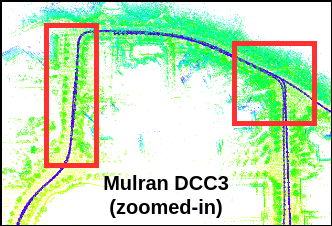

# SALSA: Swift Adaptive Lightweight Self-Attention for Enhanced LiDAR Place Recognition

📖 Paper: [`RA-L`](https://ieeexplore.ieee.org/document/10629049)

📖 Pre-print: [``arXiv``](https://arxiv.org/abs/2407.08260)

📹 Video: [`Youtube`](https://www.youtube.com/watch?v=JLunemW91bQ)

#### Authors: Raktim Gautam Goswami, Naman Patel, Prashanth Krishnamurthy, Farshad Khorrami 

#### Control/Robotics Research Laboratory (CRRL), Department of Electrical and Computer Engineering, NYU Tandon School of Engineering

### 💡 Contributions
- **SALSA**: A novel, lightweight, and efficient framework for LiDAR place recognition that delivers state-of-the-art performance while maintaining real-time operational capabilities.
- **SphereFormer**: Utilized for local descriptor extraction with radial and cubic window attention to boost localization performance for sparse distant points.
- **Adaptive Pooling**: A self-attention adaptive pooling module to fuse local descriptors into global tokens. It can aggregate arbitrary numbers of points in a point cloud without pre-processing.

- **MLP Mixer Token Aggregator**: An MLP mixer-based aggregator to iteratively incorporate global context information to generate a robust global scene descriptor.


<center>

<p>Fig. 1: Overview of our SALSA framework to generate scene descriptors from point clouds for place recognition.</p>
</center>


### 🔨 Environment creation

```bash
conda create --name salsa python=3.10.11
conda activate salsa
pip install torch torchvision torchaudio --index-url https://download.pytorch.org/whl/cu117
pip install torch-scatter -f https://data.pyg.org/whl/torch-2.0.1+cu117.html
pip install torch-sparse -f https://data.pyg.org/whl/torch-2.0.1+cu117.html
pip install torch-cluster -f https://data.pyg.org/whl/torch-2.0.1+cu117.html
pip install -r requirements.txt
pip install --no-deps timm==0.9.7
```
Install [SpTr](https://github.com/dvlab-research/SparseTransformer) from source.


### 📊💾 Dataset Download
The model is trained on Mulran Sejong 01/02 sequences and Apollo Southbay (excluding Sunnyvale). Evaluation is performed on 'easy set': Apollo-Southbay (Sunnyvale), SemanticKITTI, Mulran Sejong, and 'hard set': Mulran DCC1/DCC2, KITTI360, ALITA. The datasets can be downloaded from the following links.
- [MulRan](https://sites.google.com/view/mulran-pr/download) dataset: ground truth data (*.csv) and LiDAR point clouds (Ouster.zip).
- [Apollo-Southbay](https://developer.apollo.auto/southbay.html) dataset.
- [SemanticKITTI](http://semantic-kitti.org/dataset.html#download) dataset (velodyne point clouds and calibration data for poses).
- [ALITA](https://github.com/MetaSLAM/ALITA) dataset.
- [KITTI-360](https://www.cvlibs.net/datasets/kitti-360/user_login.php) dataset (raw velodyne scans, calibrations and vehicle poses).


### 📊💾 Dataset Pickle Creation

Create Training Pickle

```bash
cd src/data/datasets/
python southbay/generate_training_tuples.py --dataset_root <path_to_southbay_dataset>
python mulran/generate_training_tuples.py --dataset_root <path_to_mulran_dataset>
```

Create Evaluation Pickle
```bash
python mulran/generate_evaluation_sets.py --dataset_root <path_to_mulran_dataset>, --sequence sejong
python mulran/generate_evaluation_sets.py --dataset_root <path_to_mulran_dataset>, --sequence mulran
python southbay/generate_evaluation_sets.py --dataset_root <path_to_southbay_dataset>
python kitti/generate_evaluation_sets.py --dataset_root <path_to_kitti_dataset>
python kitti360/generate_evaluation_sets.py --dataset_root <path_to_kitti360_dataset>
python alita/generate_evaluation_sets.py --dataset_root <path_to_alita_dataset>
```

### ✈️ Training
Navigate to the base, create a folder inside src named checkpoints to save the trained models directory and start training.
To change the model and training parameters, change them in config/model.yaml and config/train.yaml, respectively.
```bash
mkdir -p src/checkpoints/SALSA/Model src/checkpoints/SALSA/PCA
python src/train.py
```
This will train the model on the generated training dataset and store the saved models for each epoch in src/checkpoints.

### ✈️ PCA
Learn PCA using trained model
```bash
python src/evaluate/pca.py
```
This will learn a PCA to compress and decorrelate the scene descriptor and store the learned PCA as a pytorch model in src/checkpoints.

### ✈️ Evaluation
```bash
python src/evaluate/SALSA/eval_salsa_sgv.py --dataset_root <path_to_dataset> --dataset_type <name_of_dataset> --only_global True
```
Our pre-trained models can also be downloaded from this [link](https://drive.google.com/drive/folders/1lehq0Hki75i7U_Twhd5uxxz37WvcRzGa?usp=sharing). After downloading, copy the contents into the 'src/checkpoints' directory.


### 📝 Results
The spreads of the Recall@1 before and after re-ranking for best-performing models are plotted in the following figure.
<div style="text-align: center;">
    <div>
        
        <p style="text-align: center;">Fig. 2a: 'Easy' Dataset</p>
    </div>
    <div>
        
        <p style="text-align: center;">'Fig. 2b: Hard' Dataset</p>
    </div>
    <p style="text-align: center;">Fig. 2: Box plot displaying Recall@1 across six datasets, with first to third quartile spans, whiskers for data variability, and internal lines as medians.</p>
</div>


### 🌈 Visualizations
<center>

<p>Fig. 3: Visualization of areas attended to by different tokens from the adaptive pooling layer. Each token focuses on different geometries: trees and traffic signs (green), road intersections (red), and distant points (blue).</p>
</center>

<br><br><br>

<center>

<p>Fig. 4: Point matches between query and target clouds using LoGG3D-Net and SALSA local descriptors. Matching colors indicate correspondences; circles highlight SALSA’s superior performance on sparse distant points.</p>
</center>

<br><br><br>

<div style="text-align: center;">
    <div>
        
        <p style="text-align: center;">Fig. 5a: Without Loop Detection.</p>
    </div>
    <div>
        
        <p style="text-align: center;">Fig. 5b: With Loop Detection.</p>
    </div>
    <p style="text-align: center;">Fig. 5: Comparison of LiDAR-only odometry and maps: (a) without loop detection, and (b) after online pose graph optimization from SALSA loop detections. The highlighted rectangles emphasize the map and odometry disparities due to loop closures.</p>
</div>

## 📧 Citation

If you find our work useful in your research please consider citing our publication:
```bibtex
@article{goswami2024salsa,
  title={SALSA: Swift Adaptive Lightweight Self-Attention for Enhanced LiDAR Place Recognition},
  author={Goswami, Raktim Gautam and Patel, Naman and Krishnamurthy, Prashanth and Khorrami, Farshad},
  journal={IEEE Robotics and Automation Letters},
  year={2024},
}
```